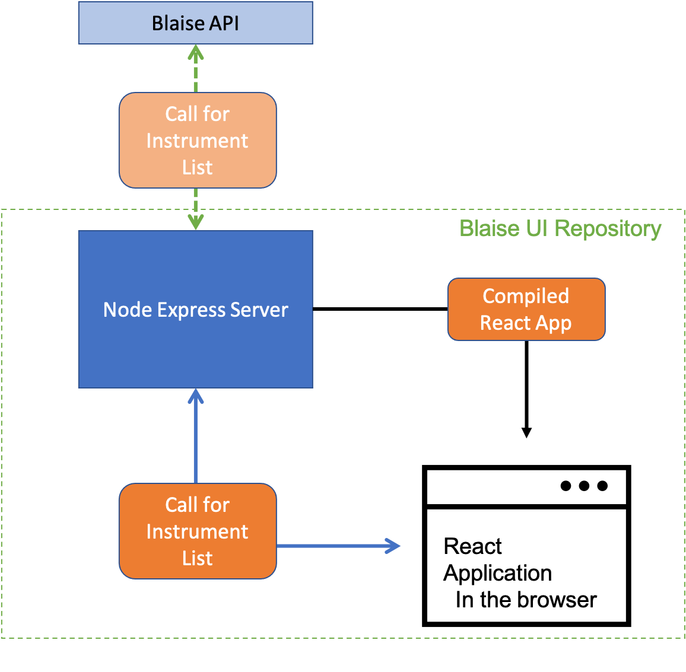

# Telephone Operations Blaise Interface

[](https://codecov.io/gh/ONSdigital/telephone-operations-blaise-interface)
[](https://github.com/ONSdigital/telephone-operations-blaise-interface/workflows/Test%20coverage%20report/badge.svg)

[](https://github.com/ONSdigital/telephone-operations-blaise-interface/pulls)
[](https://github.com/ONSdigital/telephone-operations-blaise-interface/commits)
[](https://github.com/ONSdigital/telephone-operations-blaise-interface/graphs/contributors)

Blaise Dashboard for accessing active surveys and CATI dashboard.

This project is a React application which when build is rendered by a Node.js express server.



### Setup

#### Prerequisites

To run Telephone Operations Blaise Interface locally, you'll need to have [Node installed](https://nodejs.org/en/), as
well as [yarn](https://classic.yarnpkg.com/en/docs/install#mac-stable). **NOTE:** On linux there is an issue where It
may install the wrong tool (`cmdtest` for some reason) which there is
a [solution](https://github.com/Joystream/helpdesk/issues/16).

To have the list of instruments load on the page, you'll need to
have [Blaise Rest API](https://github.com/ONSdigital/blaise-api-rest) running locally (On a Windows machine), or you
can [create an IAP tunnel](https://cloud.google.com/sdk/gcloud/reference/compute/start-iap-tunnel) from a GCP Compute
Instance running the rest API in a sandbox.

```shell
gcloud compute start-iap-tunnel restapi 90 --local-host-port=localhost:90 --zone europe-west2-a
```

#### Setup locally steps

Clone the Repo

```shell script
git clone https://github.com/ONSdigital/telephone-operations-blaise-interface.git
```

Create a new .env file and add the following variables.

| Variable                      | Description                                                                     | Var Example                  |
|-------------------------------|---------------------------------------------------------------------------------|------------------------------|
| PORT                          | Optional variable, specify the Port for express server to run on. If not passed in this is set as 5000 by default. <br><br>It's best not to set this as the react project will try and use the variable as well and conflict. By default React project locally runs on port 3000.                                              | 5009                         |
| VM_EXTERNAL_WEB_URL           | External Url used for CATI dashboard and survey links.                          | tel-client-server.uk         |
| VM_EXTERNAL_CLIENT_URL        | External link to connect to Blaise remotely through Blaise Server Manager.      | tel-web-server.uk            |
| BLAISE_API_URL                | Url that the [Blaise Rest API](https://github.com/ONSdigital/blaise-api-rest) is running on to send calls to. | localhost:90 |

The `.env` file should be setup as below

```.env
VM_EXTERNAL_WEB_URL='tel-client-server.uk'
VM_EXTERNAL_CLIENT_URL='tel-web-server.uk'
BLAISE_API_URL='localhost:90'
```

Install required modules

```shell script
yarn
```

##### Run commands

The following run commands are available, these are all setup in the `package.json` under `scripts`.

| Command                        | Description                                                                                                                                               |
|--------------------------------|-----------------------------------------------------------------------------------------------------------------------------------------------------------|
| `yarn start-server`            | Start the express server, Note: For the website to be rendered the React Project will need to be built.                                                   |
| `yarn start-react`             | Starts react project in local development setup with quick reloading on making changes. Note: For instruments to be shown the server needs to be running. |
| `yarn build-react`             | Compiles build project ready to be served by express. The build in outputted to the the `build` directory which express points to with the var `buildFolder` in `server/server.js`.                       |
| `yarn test`                    | Runs all tests for server and React Components and outputs coverage statistics.                                                                           |

##### Simple setup for local development

Setup express project that handles the requests to the [Blaise Rest API](https://github.com/ONSdigital/blaise-api-rest).
By default, will be running on PORT 5000.

```shell script
yarn start-server
```

Next to make sure the React project make requests the express server make sure the proxy option is set to the right port
in the 'package.json'

```.json
"proxy": "http://localhost:5000",
```

Run the React project for local development. By default, this will be running
on [http://localhost:3000/](http://localhost:3000/)

```shell script
yarn start-react
```

To test express sever serving the React project, you need to compile the React project, then you can see it running
at [http://localhost:5000/](http://localhost:5000/)

```shell script
yarn build-react
```

### Tests

The [Jest testing framework](https://jestjs.io/en/) has been set up in this project, all tests currently reside in
the `tests` directory. This currently only running tests on the health check endpoint, haven't got the hang of mocking
Axios yet.

To run all tests run

```shell script
yarn test
```

### Deploying to app engine

To deploy the locally edited service to app engine in your environment, you can run trigger the cloudbuild trigger with
the following line, changing the environment variables as needed.

```.shell
gcloud builds submit --substitutions=_PROJECT_ID=ons-blaise-v2-dev-matt-54,_VM_INTERNAL_URL=test,_VM_EXTERNAL_WEB_URL=test,_VM_EXTERNAL_CLIENT_URL=test,_BLAISE_API_URL=/
```

Copyright (c) 2021 Crown Copyright (Government Digital Service)
